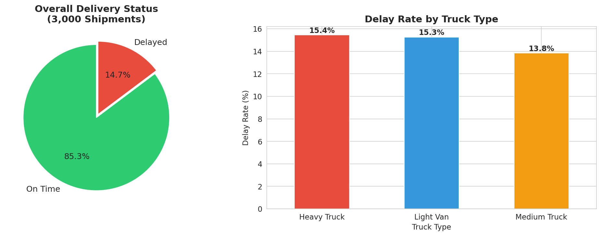
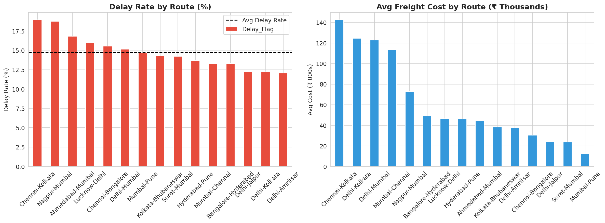
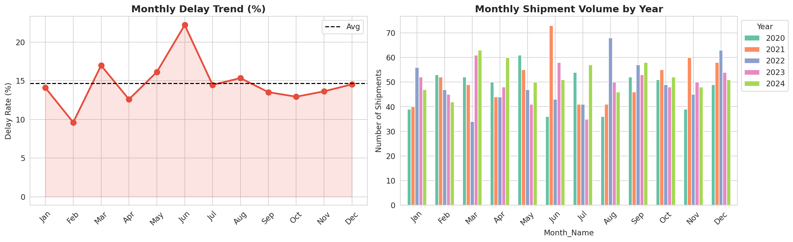
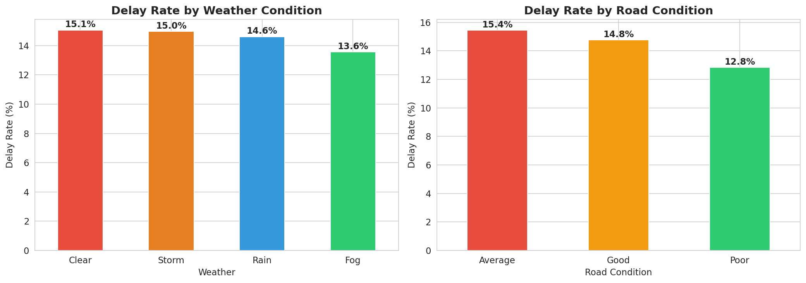
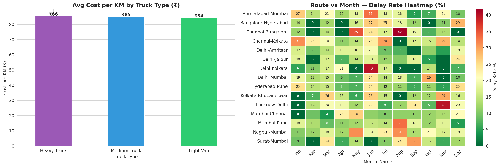
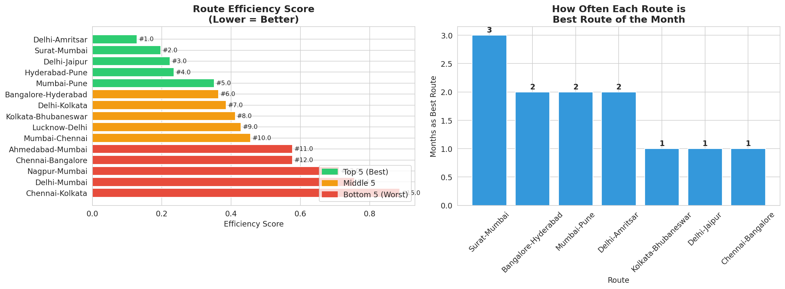
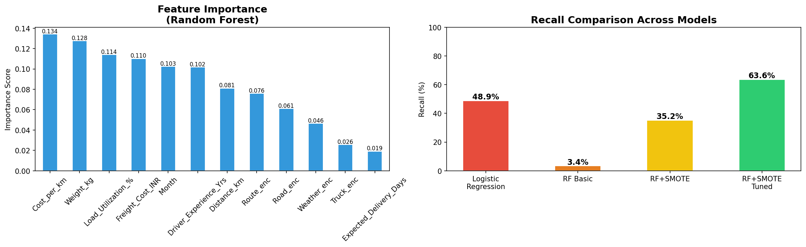
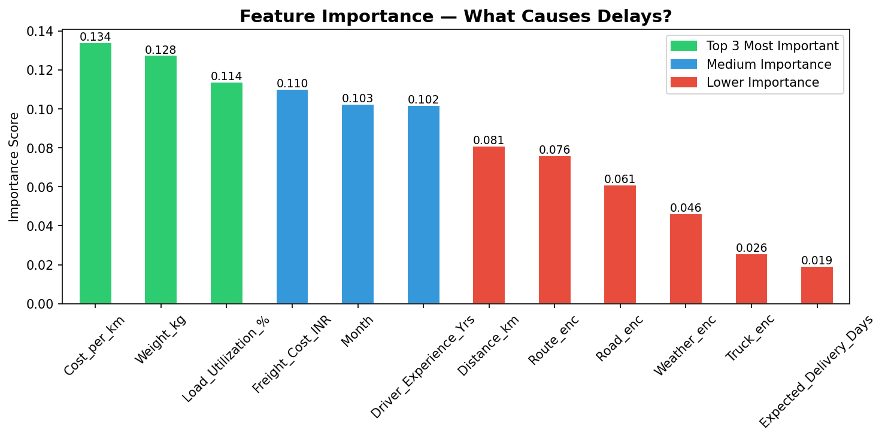

# 🚛 Smart Logistics Analytics System

> End-to-end India heavy freight logistics analytics with ML-based delay prediction and route optimization

🌐 **Live App:** [Click Here to Open](https://smart-logistics.streamlit.app)  
📂 **GitHub:** [mohdkaif3002/Smart-Logistics-Analytics](https://github.com/mohdkaif3002/Smart-Logistics-Analytics)


---

## 👥 Team — Group 82 | UCF 439 Capstone | JAN–MAY 2026

| Name | SAP ID | Contribution |
|------|--------|-------------|
| Mohammad Kaif | 1000018249 | ML Model & Route Optimization |
| Harshita Hoiyani | 1000018489 | EDA & Data Processing |
| Ansh Mittal | 1000018268 | Streamlit App & Visualization |

---

## 📌 Problem Statement

Indian logistics companies face:
- 🚚 Frequent delivery delays on major highway routes
- 💸 High and unpredictable freight costs
- ❌ No data-driven route selection system
- 📉 Poor visibility into what actually causes delays

**Our Solution:** A system that predicts delivery delays, scores route 
efficiency monthly, and recommends the optimal route — all from real 
operational data.

---

## 🏗️ Architecture
```
Data → EDA → Route Optimization → ML Model → Streamlit App
```

---

## 📊 Dataset

- 3,000 India-specific truck shipments (2020–2024)
- 15 major Indian highway routes
- 23 features: distance, weight, freight cost, weather,
  road condition, driver experience
- 14.7% real-world delay rate

---

## 📈 Key Findings

| Insight | Finding |
|---------|---------|
| Overall delay rate | 14.7% |
| Worst route | Chennai–Kolkata (19%) |
| Best route | Delhi–Amritsar (12%) |
| Worst month | June — Monsoon (22%) |
| Best month | February (10%) |
| Top delay factor | Cost per KM (importance: 0.134) |
| Heavy truck delay | 15.4% — highest among truck types |
| Most reliable truck | Medium Truck (13.8%) |

---

## 🗺️ Route Optimization

Weighted efficiency score formula:
```
Score = 0.40 × Delay_Rate + 0.35 × Cost_per_km + 0.25 × Avg_Delivery_Days
```

Lower score = Better route

| Rank | Route | Score | Delay | Cost/km |
|------|-------|-------|-------|---------|
| 🥇 1 | Delhi–Amritsar | 0.1286 | 12% | ₹84 |
| 🥈 2 | Surat–Mumbai | 0.1972 | 14% | ₹84 |
| 🥉 3 | Delhi–Jaipur | 0.2237 | 12% | ₹86 |
| ⚠️ 13 | Nagpur–Mumbai | 0.7121 | 19% | ₹85 |
| ❌ 14 | Delhi–Mumbai | 0.7569 | 15% | ₹88 |
| ❌ 15 | Chennai–Kolkata | 0.8870 | 19% | ₹86 |

**Monthly Best Routes:**
- January → Surat–Mumbai (0% delay)
- June → Surat–Mumbai (monsoon-safe)
- October → Bangalore–Hyderabad (0% delay, ₹71/km)

---

## 🤖 Machine Learning

**Target:** Predict `Delay_Flag` (0 = On Time, 1 = Delayed)  
**Challenge:** Class imbalance — 85.3% on time vs 14.7% delayed  
**Solution:** SMOTE oversampling + threshold tuning

| Model | Accuracy | Recall | F1 |
|-------|----------|--------|----|
| Logistic Regression | 49.33% | 48.86% | 22.05% |
| Random Forest | 84.33% | 3.41% | 6.00% |
| RF + SMOTE | 67.67% | 35.23% | 24.22% |
| **RF + SMOTE + Tuned** | **48.67%** | **63.64%** | **26.67%** |

> 💡 We optimized for **Recall** because missing a delay is more 
> costly than a false alarm in logistics operations.

**Top Delay Causes (Feature Importance):**
1. Cost per KM — 0.134
2. Weight — 0.128
3. Load Utilization — 0.114
4. Freight Cost — 0.110
5. Month/Season — 0.103

---

## 📸 Screenshots

### 📊 Dashboard


### 🔍 Route Analysis


### 📅 Monthly Trends


### 🌦️ Weather & Road Impact


### 🗺️ Route vs Month Heatmap


### 🏆 Route Optimization Rankings


### 📊 Model Comparison


### 🤖 Feature Importance


---

## 🛠️ Tech Stack

| Layer | Tool |
|-------|------|
| Language | Python 3.10 |
| Data Processing | Pandas, NumPy |
| Visualization | Matplotlib, Seaborn |
| Machine Learning | Scikit-learn, Imbalanced-learn (SMOTE) |
| Web App | Streamlit |
| Deployment | Streamlit Cloud |
| Environment | Google Colab |
| Version Control | GitHub |

---

## 🚀 Run Locally
```bash
# Clone repo
git clone https://github.com/mohdkaif3002/Smart-Logistics-Analytics.git
cd Smart-Logistics-Analytics

# Install dependencies
pip install -r requirements.txt

# Run app
streamlit run app/app.py
```

---

## 📁 Project Structure
```
Smart-Logistics-Analytics/
├── data/
│   ├── india_logistics_clean.csv
│   ├── route_metrics.csv
│   ├── best_routes_monthly.csv
│   └── monthly_route_scores.csv
├── charts/
│   ├── chart1_delay_overview.png
│   ├── chart2_route_analysis.png
│   ├── chart3_monthly_trends.png
│   ├── chart4_weather_road.png
│   ├── chart5_cost_heatmap.png
│   ├── chart6_route_optimization.png
│   └── chart11_feature_importance.png
├── models/
│   ├── random_forest_model.pkl
│   ├── le_route.pkl
│   ├── le_truck.pkl
│   ├── le_weather.pkl
│   ├── le_road.pkl
│   └── model_config.json
├── notebooks/
│   └── Smart_Logistics_Analytics.ipynb
├── app/
│   └── app.py
├── requirements.txt
└── README.md
```

---

## 💼 How to Explain in Interviews

*"We built an end-to-end Smart Logistics Analytics System for India's
heavy freight operations. We engineered a Route Efficiency Score
formula to recommend the best route per month, trained a Random Forest
classifier with SMOTE oversampling achieving 63.64% recall for delay
prediction, and deployed an interactive 4-page Streamlit app with a
live dashboard, delay predictor, route recommender and business
insights page."*

---

## 📚 Related Research

| Paper | Relevance |
|-------|-----------|
| Ramanathan (2001) | Freight & passenger demand forecasting in India |
| Patil & Sahu (2016) | Regression-based freight demand at Indian ports |
| ARIMA on MoRTH data (2024) | Same government data source validation |

---

*Built with ❤️ by Team Group 82 — UCF Capstone 2026*  
*Mohammad Kaif · Harshita Hoiyani · Ansh Mittal*
